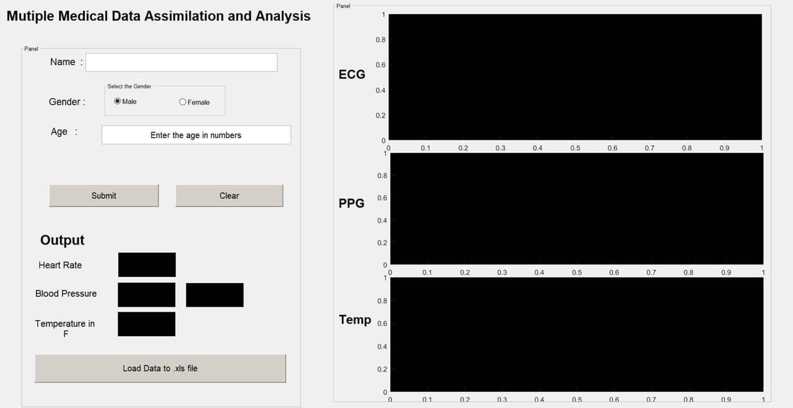

<!-- PROJECT LOGO -->
 

  

  <h3 align="center">Pervasive Healthcare</h3>

  

    Health Monitoring at your fingetip! Anywhere! Anyone! Anytime!
     
    <a href="https://github.com/karthikmprakash/Pervasive-Healthcare"><strong>Explore the docs »</strong></a>
     
     
    <a href="https://github.com/karthikmprakash/Pervasive-Healthcare/issues">Report Bug</a>
    ·
    <a href="https://github.com/karthikmprakash/Pervasive-Healthcare/issues">Request Feature</a>
  

# Pervasive Healthcare (MMDAA): Overview 
* The device is intended to reduce the load on a medical practitioner who has to monitor many number of patients or to remotely get their health updates.
* Design uses Digital Signal Processing to monitor the patient’s health characteristics.
* Monitoring becomes inherently accurate, consistent and reliable which are the most necessary qualities of a good diagnosis.
* It completely changes the way how patients are diagnosed.The innovativeness of the proposal is using the web to wirelessly stream telemetry

## Code and Resources Used 
**Matlab Version:** 2012  
**Hardware used:** Sensors PCB, Arduino UNO, ESP8266   
**ECG Design Guide:** https://medcraveonline.com/IJBSBE/design-of-an-ecg-sensor-circuitry-for-cardiovascular-disease-diagnosis.html  
**PPG Design Guide:** https://www.hindawi.com/journals/js/2020/7192015/  
**Matlab Guide:** https://www.mathworks.com/discovery/matlab-gui.html  
**Arduino UNO Guide:** https://www.arduino.cc/en/Guide/  
**ESP8266 Guide:** https://arduino-esp8266.readthedocs.io/en/latest/esp8266wifi/server-examples.html  

## Working Model  

<figure><figcaption align="center">Data Collection GUI on Matlab</figcaption></figure>

## Productionization 
* With SMD devices embedded on a PCB the entire project can be fitted inside a box of match. ECG electrodes aside.
*  The data gathered is MQTT ready to be visualized over the web. 
*  This project has been developed with the vision to mitigate mortality due to lack of timely diagnosis
*  But in the proposed design any lay man with the most basic knowledge about, how to stick a few electrode stickers and how to clip a pulse oximeter to a finger will be able use the device right at the comfort of their homes.
 
 

<!-- MARKDOWN LINKS & IMAGES -->
<!-- https://www.markdownguide.org/basic-syntax/#reference-style-links -->
[contributors-shield]: https://img.shields.io/github/contributors/othneildrew/Best-README-Template.svg?style=for-the-badge
[contributors-url]: https://github.com/othneildrew/Best-README-Template/graphs/contributors
[forks-shield]: https://img.shields.io/github/forks/othneildrew/Best-README-Template.svg?style=for-the-badge
[forks-url]: https://github.com/karthikmprakash/Temp_email_Telegram_bot/network/members
[stars-shield]: https://img.shields.io/github/stars/othneildrew/Best-README-Template.svg?style=for-the-badge
[stars-url]: https://github.com/othneildrew/Best-README-Template/stargazers
[issues-shield]: https://img.shields.io/github/issues/othneildrew/Best-README-Template.svg?style=for-the-badge
[issues-url]: https://github.com/othneildrew/Best-README-Template/issues
[license-shield]: https://img.shields.io/github/license/othneildrew/Best-README-Template.svg?style=for-the-badge
[license-url]: https://github.com/othneildrew/Best-README-Template/blob/master/LICENSE.txt
[linkedin-shield]: https://img.shields.io/badge/-LinkedIn-black.svg?style=for-the-badge&logo=linkedin&colorB=555
[linkedin-url]: https://linkedin.com/in/othneildrew
[product-screenshot]: images/screenshot.png
